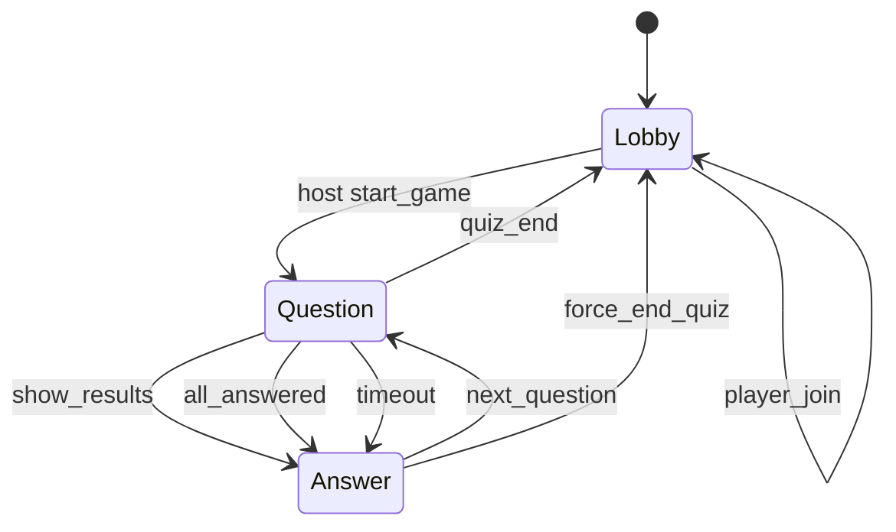

# Quiz UFPA state machine

This document describes the quiz game flow managed by the server-side state machine in server.js.

## Overview

The game state is stored in a single in-memory object (gameState) and persisted to disk to allow recovery. The state machine is driven by Socket.IO events sent by the host and players.

## States

- LOBBY (STATE_LOBBY = 0)
  - Waiting room. Players can join. No active question.
  - currentQuestion is -1, questionDeadline is null.

- QUESTION (STATE_QUESTION = 1)
  - A question is active and answers are accepted until the deadline.
  - questionDeadline is set and a timer is scheduled.

- ANSWER (STATE_ANSWER = 2)
  - The correct answer and distribution are revealed.
  - The host can advance to the next question.

- GAME OVER (STATE_GAMEOVER = 3)
  - This constant exists but is not persisted in gameState.
  - The server emits game_over and immediately clears gameState back to LOBBY.

## Core data

- gameState.hostSid: current host socket id (null when no host is connected).
- gameState.players: { socketId: nickname }
- gameState.currentQuestion: index of the current question.
- gameState.answers: { socketId: optionIndex }
- gameState.scores: { socketId: totalScore }
- gameState.state: LOBBY | QUESTION | ANSWER
- gameState.questionDeadline: unix ms timestamp, used for timers.
- quizData: loaded quiz JSON (title, questions).
- playerSessions: Map of sessionToken -> { sid, nickname } for reconnects.

## State transitions

Mermaid diagram (conceptual):

Transition table (server-side events):

| From | Event | Guard | To | Key actions |
| --- | --- | --- | --- | --- |
| LOBBY | host start_game | valid quiz | QUESTION | resetGameForNewQuiz, advanceQuestion, schedule timer |
| QUESTION | show_results | host only | ANSWER | finalizeQuestionResults, clear timer |
| QUESTION | submit_answer | player only | QUESTION or ANSWER | record answer; if all answered -> finalizeQuestionResults |
| QUESTION | question_time_over | deadline passed | ANSWER | finalizeQuestionResults |
| QUESTION | next_question | host only | QUESTION | advanceQuestion (can skip results) |
| ANSWER | next_question | host only | QUESTION | advanceQuestion |
| QUESTION | quiz_end | last question | LOBBY | emit game_over, export scores, clearGameState |
| ANSWER | force_end_quiz | host only | LOBBY | emit game_over, export scores, clearGameState |
| ANY | host disconnect | hostSid match | same state | hostSid=null, saveFullState, emit host_disconnected |

## Timers and deadlines

- When entering QUESTION, questionDeadline is set to now + QUESTION_DURATION_MS.
- scheduleQuestionTimer uses that deadline; on expiration it emits question_time_over and finalizes results.
- finalizeQuestionResults clears the timer and moves to ANSWER.

## Persistence and recovery

- saveFullState writes .private/game_save.json with gameState, playerSessions, and quizData.
- restoreFullState loads it and clears hostSid to force a new host_join.
- On restart, if state is QUESTION, scheduleQuestionTimer is called to continue the countdown.

## Game over behavior

- When the last question is completed, the server emits game_over, exports scores to scores/*.csv, clears gameState, and deletes the saved game file.
- There is no durable GAME OVER state; the system returns to LOBBY immediately after game_over.

## Socket events by role

Host:
- host_join, start_game, next_question, show_results, force_end_quiz, clear_saved_game

Player:
- player_join, submit_answer, restore_session

Broadcast:
- show_question, show_results, update_answer_count, game_over, question_time_over, host_disconnected
